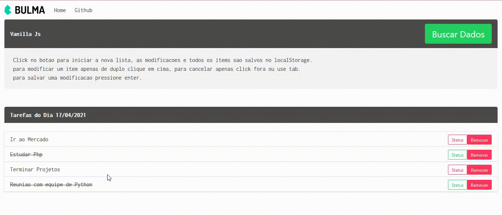

# Simples Todo app

## Bulma framework

```
projeto feito manipulando o DOM usando javascript para construir um todo app com CRUD.
os dados sao salvos no localStorage.
```

```sh
# iniciar o projeto, tenha o npm instalando

$ npm install

$ npm run dev
```

